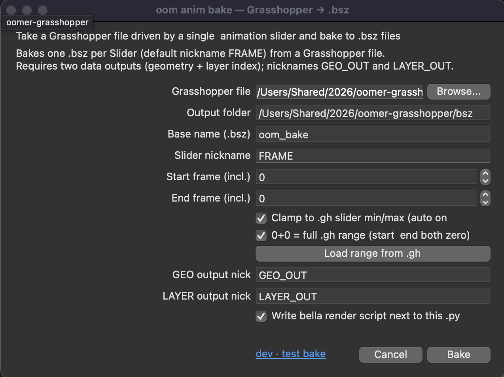
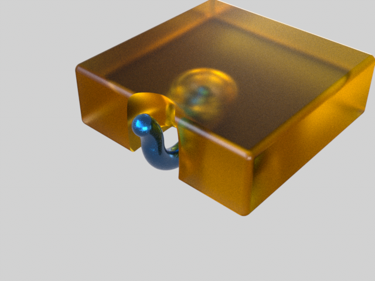
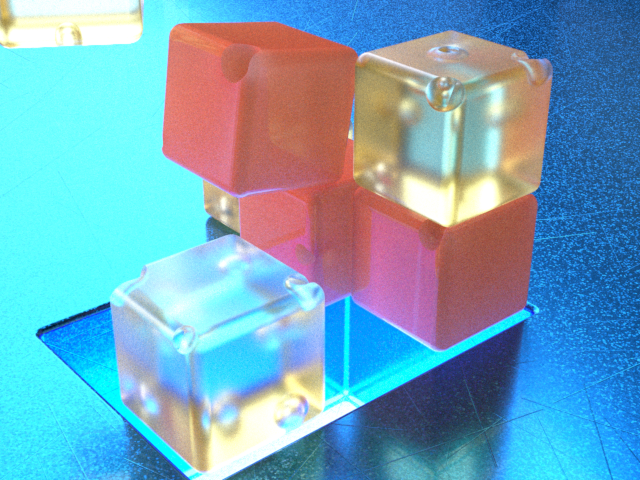
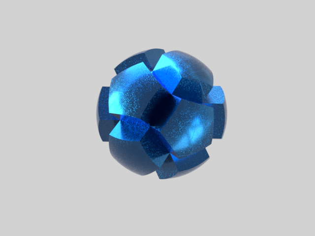
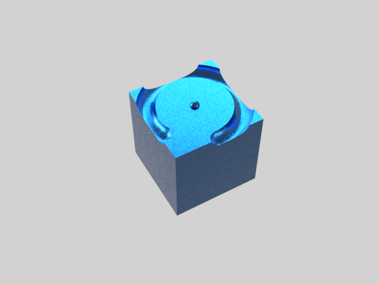

# ghoomer

Tools and examples for going from Rhino Grasshopper to Bella.

>Grasshopper does NOT have a traditional timeline like Blender, requiring us to represent time as a slider called **FRAME**

## Load **ghoomer_stage.3dm**

- set Bella material → Layer 1,2,3,4,5
- set cam + lights

## Start Grasshopper
Basically, if you can "scrub" a slider and something changes then you're ready to export to Bella.

> Playing with the Grasshopper **season1** examples, reveals that a handful of extra nodes preps the program for Bella export.
Instead of material baking ( which isn't ready ) material-less geometry gets baked into layers→**ghoomer_stage.3dm**  

- Add slider → **FRAME** ie 0-30, 
- Use **FRAME** to represent time in your program
- Nickname "bake" endpoints **LAYER_OUT** + **GEO_OUT**

From Grasshopper we "sort" using 2 **Entwine** nodes.
Copy paste from examples, it's a data-tree thingy with nicknames to know what to export.
- **Value List**→**Entwine**→**Data**  **LAYER_OUT**
- Your geometry→**Entwine**→**Data**  **GEO_OUT**

## Start ScriptEditor 
Run **ghoomer_to_bella.py** to write out .bsz files

## season1
Grasshopper animation examples

